# ESPECIFICACIÓN INTEGRAL DE REQUISITOS DE SOFTWARE (SRS)

**Proyecto:** Sistema Inteligente de Gestión de Inventarios RFID, Control de Existencias, Calidad y Decisiones de Importación  
**Estándar de referencia:** IEEE 830 / ISO/IEC/IEEE 29148  
**Versión:** 4.0 — Ajustada para ESP32-S3 + MFRC522, paletas completas, puchos y fórmulas de proyección validadas con datos reales de `Stock_Ledger.xlsx`

---

## 1. Propósito

Este documento especifica los requisitos funcionales y no funcionales de un sistema web y un dispositivo portátil de inventario basado en RFID.

El sistema permite:

- Gestionar productos, categorías, almacenes, empaque y estibado.
- Controlar inventario por producto y almacén.
- Registrar movimientos de ingreso, despacho, retiro parcial, auditoría y ajuste autorizado.
- Recibir mercancía mediante escaneo RFID de paletas completas y cajas pucho.
- Realizar auditorías de exactitud de inventario (ERI) mediante conteo secuencial.
- Mantener trazabilidad de lecturas, sesiones, movimientos y conciliaciones.
- Analizar consumo, semáforo de reposición, clasificación ABC, compras e importaciones, con fórmulas de proyección validadas contra un ledger real de inventario.
- Trabajar sin conexión temporal y sincronizar eventos posteriormente.

---

## 2. Alcance y definiciones

### 2.1 Arquitectura RFID definida

| Componente | Especificación | Función |
|---|---|---|
| Microcontrolador | ESP32-S3-WROOM-1 | Procesamiento, Wi-Fi, pantalla, cola offline y lógica de operación |
| Lector RFID | MFRC522 | Lectura RFID HF mediante SPI |
| Frecuencia RFID | 13,56 MHz | Identificación de corto alcance |
| Tags | MIFARE Classic 1K o NTAG213 | Identificación de paletas completas, cajas pucho u otros objetos definidos |
| Pantalla | OLED 0,96 pulgadas SSD1306 por I2C | Navegación, datos de operación, errores y estado del dispositivo |
| Control | Encoder rotativo con pulsador | Navegación, confirmación y ajuste de cantidades |
| Alertas | Buzzer activo y LED RGB | Confirmación de lectura, error y estado de sincronización |
| Alimentación | LiPo 3,7 V + TP4056 + LDO 3,3 V | Alimentación portátil regulada |

El MFRC522 opera con lectura RFID HF de corto alcance. El operario debe acercar el tag al lector, usualmente a una distancia máxima aproximada de 5 cm. El sistema no utiliza EPC UHF, RSSI de UHF, lectores de portón ni lectura automática de larga distancia.

### 2.2 Definiciones operativas

| Término | Definición |
|---|---|
| Producto | Artículo comercial identificable mediante SKU y ficha técnica |
| Almacén | Ubicación lógica o física donde se controla inventario |
| Paleta completa | Unidad logística formada por la cantidad estándar de cajas definida en el esquema de estibado |
| Pucho | Caja suelta que no completa una paleta estándar |
| Caja | Empaque intermedio que contiene un número definido de unidades |
| Unidad | Cantidad mínima inventariable del producto |
| Camada | Nivel horizontal de cajas dentro de una paleta |
| Fila | Distribución horizontal de cajas dentro de una camada; no es sinónimo de camada |
| Sesión de escaneo | Proceso identificable y persistente de recepción, auditoría o conteo |
| UID RFID | Identificador único obtenido desde una etiqueta MIFARE o NTAG |
| Tag duplicado | UID leído más de una vez dentro de la misma sesión u operación; es un resultado de lectura, no un estado permanente del tag |
| Consumo real | Salida de inventario que representa venta o despacho efectivo, usada para proyección |
| Mes sin movimiento | Mes calendario dentro del rango de análisis en el que un producto no registró salidas; debe contarse como consumo cero, no debe excluirse del promedio |

### 2.3 Ejemplo de cálculo de empaque

Si para un producto se define:

- 5 cajas por fila.
- 6 filas por camada.
- 1 camada por paleta.
- 10 unidades por caja.

\[
CajasPorCamada = 5 \times 6 = 30
\]

\[
CajasPorPaleta = CajasPorCamada \times NumeroCamadas = 30
\]

\[
UnidadesPorPaleta = 30 \times 10 = 300
\]

Si se reciben 3 paletas completas y 8 puchos:

\[
TotalCajas = (3 \times 30) + 8 = 98
\]

\[
TotalUnidades = 98 \times 10 = 980
\]

### 2.4 Validación de fórmulas de proyección con datos reales

Usando el histórico real de `ROLLO CONTOMETRO` en `Stock_Ledger.xlsx`, se identificó que un mes sin transacciones (2026-06) desaparece del cálculo si el sistema agrupa solo meses con movimientos, en lugar de generar la serie completa de meses del calendario. Esto infla artificialmente el promedio mensual y puede ocultar riesgo de quiebre. Las fórmulas de este documento ya incorporan la corrección (ver RF-07).

---

## 3. Requisitos funcionales

### Módulo 1: Captura e ingesta de datos IoT/RFID

### [RF-01] Captura de lecturas RFID HF por proximidad

**Descripción:** El sistema debe permitir capturar individualmente el UID de etiquetas RFID HF de 13,56 MHz mediante un dispositivo portátil ESP32-S3 equipado con un módulo MFRC522.

**Actor principal:** Operario de almacén mediante ESP32-S3 + MFRC522.

**Precondiciones:**

- El ESP32-S3 debe tener un almacén activo configurado.
- El operario debe haber seleccionado una operación desde el menú del dispositivo.
- El dispositivo debe contar con configuración de red o con almacenamiento offline disponible.

**Entrada:** Solicitud de lectura con los siguientes campos mínimos:

- `uid_hex`
- `dispositivo_id`
- `almacen_id`
- `tipo_evento`: CONSULTA, MOVIMIENTO, RECEPCION, AUDITORIA o ENROLAMIENTO
- `id_sesion_escaneo`, si aplica
- `fecha_hora_lectura`
- `id_operario`, si aplica
- `id_evento`, identificador único para idempotencia

**Proceso:**

1. El operario selecciona una operación en el menú.
2. El dispositivo muestra el mensaje "Acerque el tag al lector".
3. El operario aproxima el tag RFID al MFRC522.
4. El MFRC522 obtiene el UID a través del bus SPI.
5. El ESP32-S3 emite una señal visual y sonora de lectura.
6. El dispositivo verifica que el UID no haya sido leído previamente dentro de la misma sesión o ventana de anti-rebote.
7. Si hay conectividad, el dispositivo envía la lectura al backend.
8. El backend valida el dispositivo, el almacén activo, el UID y el tipo de evento.
9. Si el UID existe, devuelve la información asociada y el resultado de validación.
10. Si el UID no existe, registra el evento como `NO_IDENTIFICADO`.
11. Si no hay conectividad o falla la API, el dispositivo guarda el evento en LittleFS como pendiente de sincronización.

**Salida:** Lectura RFID con resultado `VALIDADA`, `DUPLICADA`, `NO_IDENTIFICADA`, `RECHAZADA_POR_REGLA`, `ERROR_API` o `PENDIENTE_SINCRONIZACION`.

**Prioridad:** Alta.

### [RF-02] Registro inalterable de lecturas y transacciones

**Descripción:** El sistema debe guardar un historial inalterable de cada lectura RFID y de cada movimiento de inventario confirmado.

**Proceso:**

1. El sistema almacena cada lectura RFID, incluso si fue duplicada, no identificada o rechazada.
2. El sistema solo genera un movimiento de inventario cuando la operación pasa las reglas de validación y requiere afectar stock.
3. El movimiento debe indicar si se origina por una paleta completa, caja pucho, caja, unidad o ajuste autorizado.
4. El registro debe guardar producto, almacén, usuario, dispositivo, sesión, recepción, UID, fecha, cantidad y resultado.
5. Los movimientos confirmados no pueden eliminarse; una corrección debe realizarse mediante un movimiento inverso o ajuste autorizado.

**Campos mínimos de movimiento:**

```text
id_movimiento, id_producto, id_almacen, uid_hex, id_lectura, id_sesion_escaneo,
id_recepcion, id_operario, id_dispositivo, tipo_movimiento, tipo_objeto_etiquetado,
cantidad_cajas, cantidad_unidades, fecha_hora, estado_sincronizacion, observacion
```

**Prioridad:** Alta.

### [RF-03] Actualización atómica del stock por producto y almacén

**Descripción:** El sistema debe actualizar el inventario disponible de manera atómica después de confirmarse un movimiento válido.

**Proceso:**

1. El backend inicia una transacción de base de datos.
2. Consulta y bloquea el registro correspondiente a `Producto + Almacén`.
3. Calcula el nuevo stock en unidades.
4. Valida que una salida no produzca inventario negativo, salvo ajuste autorizado explícito.
5. Inserta el movimiento de inventario.
6. Actualiza el registro `StockAlmacen`.
7. Confirma la transacción.
8. El stock global del producto se obtiene, si es necesario, como la suma de todos los almacenes.

\[
StockAlmacen_{nuevo} = StockAlmacen_{actual} \pm CantidadUnidades
\]

**Prioridad:** Alta.

### [RF-04] Modo simulador de movimientos y lecturas

**Descripción:** El sistema debe permitir cargar lotes de movimientos o lecturas simuladas para probar analítica, recepción, conciliación y trazabilidad sin depender del hardware físico.

**Entrada:** Archivo Excel (`.xlsx`) o JSON, con estructura compatible con un ledger de inventario (fecha, producto, almacén, cantidad entrante, cantidad enviada, balance, tipo de comprobante, tasa de valoración).

**Proceso:**

1. El usuario carga el archivo desde el sistema web.
2. El sistema valida estructura, columnas, tipos y datos obligatorios.
3. El sistema muestra errores antes de importar.
4. El sistema inserta los datos como simulados, diferenciándolos de eventos reales.
5. El sistema recalcula los indicadores analíticos cuando corresponda.

**Prioridad:** Alta.

---

### Módulo 2: Motor analítico, control de existencias y ABC

### [RF-05] Selección dinámica del rango de análisis

**Descripción:** El sistema debe permitir seleccionar la ventana histórica para analizar consumos.

**Proceso:**

1. El usuario selecciona un rango de fechas o periodo predefinido (3, 6 o 12 meses).
2. El backend genera la serie completa de meses calendario entre la fecha inicial y la fecha final del rango, sin omitir meses sin movimientos.
3. El backend filtra los movimientos de salida del periodo y los agrupa por mes según esa serie completa.
4. El sistema recalcula las métricas mostradas.

**Prioridad:** Alta.

### [RF-06] Normalización y filtrado de consumos reales

**Descripción:** El sistema debe normalizar los movimientos de salida para evitar distorsiones causadas por convenciones de signos heredadas y debe excluir del cálculo de consumo cualquier movimiento que no represente una salida real por venta o despacho.

**Proceso:**

1. Cada movimiento debe clasificarse según su tipo de comprobante en una de las siguientes categorías:
   - `CONSUMO_REAL`: ventas, despachos a tienda o consumo interno reconocido como salida definitiva.
   - `TRASLADO_INTERNO`: movimientos entre almacenes propios; no afecta el consumo.
   - `AJUSTE`: correcciones de conteo; no afecta el consumo salvo configuración explícita del administrador.
   - `INGRESO`: entradas de mercancía; no participa en la normalización de salidas.
2. Solo los movimientos marcados como `CONSUMO_REAL` se incluyen en el cálculo de consumo normalizado.
3. Para esos movimientos, el sistema aplica valor absoluto sobre la cantidad cuando la fuente de datos registre las salidas con signo negativo.

\[
ConsumoNormalizado = ABS(Cantidad) \quad \text{solo si } TipoComprobante = CONSUMO\_REAL
\]

**Salida:** Dataset de consumo real, limpio de traslados y ajustes, listo para el cálculo del promedio.

**Prioridad:** Alta.

### [RF-07] Cálculo dinámico de indicadores de reposición

**Descripción:** El sistema debe calcular indicadores de reposición por producto y, cuando aplique, por almacén, garantizando que los meses sin consumo se contabilicen como cero y no se excluyan del promedio.

**Proceso:**

1. Generar la serie completa de meses calendario del rango seleccionado.
2. Para cada mes de la serie, asignar el consumo normalizado correspondiente; si el mes no tiene movimientos, su consumo es cero.
3. Calcular el promedio dividiendo entre el número total de meses de la serie, no entre el número de meses con movimientos.

\[
PromedioMensual = \frac{\sum_{m=1}^{N} ConsumoNormalizado_m}{N}
\]

donde \(N\) es el número de meses calendario del rango seleccionado, incluyendo meses en cero.

\[
StockMinimoBase = PromedioMensual \times 3
\]

\[
StockMinimoFinal = StockMinimoBase \times 1.20
\]

\[
MD =
\begin{cases}
\text{"Sin consumo — revisar clasificación"}, & PromedioMensual = 0 \text{ y } StockReal > 0 \\
0, & PromedioMensual = 0 \text{ y } StockReal = 0 \\
\dfrac{StockReal}{PromedioMensual}, & PromedioMensual > 0
\end{cases}
\]

**Prioridad:** Alta.

### [RF-08] Clasificación por semáforo de control

**Descripción:** El sistema debe asignar un estado visual basado en los meses de duración, incluyendo un estado explícito para productos sin consumo.

- Si `MD > 3.0`: 🟢 **NO COMPRAR**.
- Si `2.0 <= MD <= 3.0`: 🟡 **EVALUAR**.
- Si `MD < 2.0`: 🔴 **COMPRAR PRIORITARIO**.
- Si `PromedioMensual = 0`: ⚪ **SIN CONSUMO / REVISAR**.

**Prioridad:** Alta.

### [RF-09] Clasificación de inventarios por análisis de Pareto (ABC)

**Descripción:** El sistema debe estratificar el catálogo según el valor monetario del consumo real acumulado, usando el costo o tasa de valoración de cada producto.

**Proceso:**

\[
ValorConsumoProducto = \sum ABS(CantidadEnviada) \times TasaDeValoracion \quad \text{(solo CONSUMO\_REAL)}
\]

\[
\%Individual_i = \frac{ValorConsumoProducto_i}{\sum_{\text{todos}} ValorConsumoProducto} \times 100
\]

\[
\%Acumulado_i = \sum_{k=1}^{i} \%Individual_k \quad \text{(productos ordenados de mayor a menor valor)}
\]

**Clasificación:**

- Clase A: hasta 80% acumulado.
- Clase B: de 80,01% a 95% acumulado.
- Clase C: de 95,01% a 100% acumulado.

**Prioridad:** Alta.

---

### Módulo 3: Compras, importaciones, empaque y cubicaje

### [RF-10] Sugerido automático de importación

\[
CantidadSugerida = \max(0,\ StockMinimoFinal - StockReal)
\]

Si el estado es verde o sin consumo, el sugerido inicial es 0, salvo decisión manual del comprador.

**Prioridad:** Alta.

### [RF-11] Modificación manual de cantidades de pedido

**Validaciones:**

- El valor debe ser numérico entero y mayor o igual a cero.
- El sistema debe recalcular cajas, paletas completas, puchos, volumen, peso y proyección.

**Prioridad:** Alta.

### [RF-12] Simulación de cubicaje y ocupación de contenedor

\[
VolumenTotal = \sum(CantidadPedida_i \times VolumenUnitario_i)
\]

\[
PesoTotal = \sum(CantidadPedida_i \times PesoUnitario_i)
\]

\[
\%OcupacionVol = \left(\frac{VolumenTotal}{CapacidadMaximaVolumen}\right) \times 100
\]

**Prioridad:** Alta.

### [RF-13] Emisión y cambio de estado de orden de importación

**Estados:** `BORRADOR → EN_TRANSITO → EN_ADUANA → RECIBIDO_EN_ALMACEN`

**Prioridad:** Alta.

### [RF-14] Evaluación OTIF del proveedor

\[
OnTime = \begin{cases} 1, & FechaReal \le FechaPrometida \\ 0, & FechaReal > FechaPrometida \end{cases}
\]

\[
InFull = \begin{cases} 1, & UnidadesRecibidas \ge UnidadesSolicitadas \\ 0, & UnidadesRecibidas < UnidadesSolicitadas \end{cases}
\]

\[
OTIF\% = (OnTime \times InFull) \times 100
\]

**Prioridad:** Media.

---

### Módulo 4: Recepción de mercancía, paletas completas y puchos

### [RF-15] Recepción por producto mediante paletas completas y puchos

**Proceso:**

1. Seleccionar almacén de destino.
2. Seleccionar orden de importación, si existe.
3. Seleccionar producto.
4. Cargar cajas por paleta, unidades por caja y unidades por paleta.
5. Iniciar escaneo de paletas completas.
6. Por cada UID válido: `total_paletas_completas += 1`; `total_cajas_de_paletas += cajas_por_paleta`; `total_unidades += cajas_por_paleta × unidades_por_caja`.
7. Mostrar recuento acumulado.
8. Permitir pausar.
9. Al pausar, mostrar tres opciones: Reanudar paletas completas, Escanear puchos, Terminar escaneo.
10. En modo puchos: por cada UID o registro manual válido, `total_puchos += 1`; `total_cajas += 1`; `total_unidades += unidades_por_caja`.
11. No incrementar paletas completas por puchos.
12. Al terminar, mostrar resumen para confirmación.
13. Tras confirmar, generar movimientos de ingreso y actualizar stock por almacén de forma atómica.

**Prioridad:** Alta.

### [RF-16] Pausa, reanudación y cierre de sesión de escaneo

**Proceso:**

1. Pausar sesión en curso.
2. Persistir producto, almacén, orden, operario, dispositivo, tags leídos, totales acumulados y fecha de pausa.
3. Estado pasa a `PAUSADA`.
4. Al reanudar, recuperar acumulados y evitar duplicar UIDs.
5. Opciones: reanudar paletas, escanear puchos, terminar.
6. Al finalizar, estado pasa a `PENDIENTE_CONFIRMACION`.
7. Solo tras confirmación se registran movimientos que afectan stock.
8. Sin red, guardar sesión y eventos en LittleFS.

**Prioridad:** Alta.

### [RF-17] Conciliación ciega de recepción

**Proceso:**

1. Seleccionar orden y producto.
2. Iniciar recepción ciega.
3. Escanear paletas completas y puchos secuencialmente.
4. Acumular resultados físicos.
5. Comparar con lo esperado tras finalizar.
6. Clasificar como `COMPLETA`, `CON_FALTANTES`, `CON_SOBRANTES` o `CON_DISCREPANCIAS`.
7. Mostrar diferencias de paletas, cajas y unidades.

**Prioridad:** Alta.

---

### Módulo 5: Exactitud de inventario, calidad y trazabilidad

### [RF-18] Auditoría ERI por conteo RFID secuencial

**Fórmula:**

\[
ERI =
\begin{cases}
100\%, & StockFisico = 0 \text{ y } StockTeorico = 0 \\
0\%, & StockFisico = 0 \text{ y } StockTeorico > 0 \\
\max\left(0, 1 - \dfrac{|StockFisico - StockTeorico|}{StockFisico}\right) \times 100, & StockFisico > 0
\end{cases}
\]

**Meta de referencia:** `ERI ≥ 98%`.

**Prioridad:** Media.

### [RF-19] Matriz AMFE

\[
NPR = Severidad \times Ocurrencia \times Deteccion
\]

**Prioridad:** Media.

### [RF-20] Aplicación de 5S en datos e interfaz

**Prioridad:** Media.

---

### Módulo 6: Empaque, estibado y simulación interactiva

### [RF-21] Definición de factores de conversión de empaque

\[
CajasPorCamada = CajasPorFila \times FilasPorCamada
\]

\[
CajasPorPaleta = CajasPorCamada \times NumeroCamadas
\]

\[
UnidadesPorPaleta = CajasPorPaleta \times UnidadesPorCaja
\]

\[
VolumenCajaM3 = \frac{LargoCm \times AnchoCm \times AltoCm}{1{,}000{,}000}
\]

**Prioridad:** Alta.

### [RF-22] Recálculo de compra a cajas, paletas completas y puchos

\[
TotalCajas = \left\lceil \frac{CantidadComprarUnidades}{UnidadesPorCaja} \right\rceil
\]

\[
PaletasCompletas = \left\lfloor \frac{TotalCajas}{CajasPorPaleta} \right\rfloor
\]

\[
CajasPucho = TotalCajas \bmod CajasPorPaleta
\]

\[
TotalUnidades = TotalCajas \times UnidadesPorCaja
\]

**Prioridad:** Alta.

### [RF-23] Recálculo instantáneo por modificación de cantidad a comprar

**Prioridad:** Alta.

### [RF-24] Simulación What-If con promedio simple o ponderado

**Descripción:** El sistema debe permitir modificar valores teóricos como promedio mensual, lead time o venta proyectada, y debe permitir alternar entre promedio simple y promedio ponderado por recencia para evaluar escenarios antes de emitir una orden.

**Fórmula de promedio ponderado:**

\[
PromedioPonderado = \frac{\sum_{m=1}^{N} (ConsumoNormalizado_m \times Peso_m)}{\sum_{m=1}^{N} Peso_m}
\]

**Pesos sugeridos por defecto (configurables en `ParametroGlobal`):**

```text
Mes actual - 1: peso 3
Mes actual - 2: peso 2
Mes actual - 3: peso 1
Meses anteriores: peso 1
```

**Prioridad:** Alta.

### [RF-25] Cambio de esquema de estibado

**Prioridad:** Alta.

### [RF-26] Cálculo de fecha estimada de quiebre de stock

**Descripción:** El sistema debe proyectar la fecha en la que el stock real llegará a cero, asumiendo consumo constante igual al promedio mensual dinámico (o ponderado, si está activo).

\[
ConsumoDiario = \frac{PromedioMensual}{30.44}
\]

\[
DiasRestantes = \frac{StockReal}{ConsumoDiario}
\]

\[
FechaQuiebre = FechaActual + DiasRestantes
\]

**Reglas:**

- Si `PromedioMensual = 0`, no calcular fecha; mostrar "Sin proyección disponible".
- Si `StockReal = 0`, la fecha de quiebre es la fecha actual.

**Ejemplo validado con datos reales (`ROLLO CONTOMETRO`):**

```text
PromedioMensual = 17,250 unidades/mes
StockReal = 98,000 unidades
ConsumoDiario = 566.69 unidades/día
DiasRestantes = 172.9 días
FechaQuiebre ≈ 16 de enero de 2027
```

**Prioridad:** Alta.

---

## 4. Requisitos no funcionales

### [RNF-01] Tiempo de respuesta de lectura y validación

Lectura local inmediata en pantalla; con red, respuesta del backend menor a 500 ms bajo condiciones normales.

### [RNF-02] Escalabilidad analítica

Consultas con hasta 100,000 movimientos históricos deben cargar en menos de 2 segundos.

### [RNF-03] Seguridad y control de acceso

RBAC (Administrador, Comprador, Operario, Auditor), HTTPS, contraseñas con bcrypt, sesiones JWT, token por dispositivo ESP32-S3, auditoría de acciones sensibles.

### [RNF-04] Operación offline e idempotencia

NVS/EEPROM para configuración; LittleFS para lecturas, movimientos, sesiones pausadas y UIDs leídos. Backend idempotente por `id_evento`.

### [RNF-05] Usabilidad en el dispositivo

Mensajes cortos, confirmación con buzzer/LED, distinción clara de errores, visualización de paletas/puchos/cajas/unidades durante recepción.

### [RNF-06] Reactividad web

Recalcular simulaciones en menos de 50 ms sin recarga de página.

### [RNF-07] Integridad y concurrencia

Transacciones atómicas; prevención de stock negativo no autorizado, doble contabilización de UID, doble confirmación de recepción y sincronización duplicada.

### [RNF-08] Integridad del cálculo de proyección

**Descripción:** El motor analítico debe garantizar que ningún mes calendario dentro del rango seleccionado quede excluido del cálculo de promedio, incluso si no tuvo movimientos, y debe excluir explícitamente traslados internos y ajustes del consumo real utilizado para proyección.

**Criterio de aceptación:** Al comparar el número de meses usados en el cálculo contra el número de meses calendario del rango seleccionado, ambos deben coincidir siempre.

---

## 5. Estados, tipos y reglas de negocio

### 5.1 Estados del tag
```text
DISPONIBLE, ASIGNADO, EN_RECEPCION, VALIDADO, EN_STOCK, DESPACHADO, RETIRADO, BLOQUEADO
```

### 5.2 Tipos de objeto etiquetado
```text
PALETA_COMPLETA, CAJA_PUCHO, CAJA, UNIDAD
```

### 5.3 Tipos de movimiento
```text
INGRESO_PALETA_COMPLETA, INGRESO_PUCHO, DESPACHO_TOTAL, RETIRO_PARCIAL, AJUSTE_AUTORIZADO, CONTEO_AUDITORIA
```

### 5.4 Tipos de comprobante para consumo (nuevo, RF-06)
```text
CONSUMO_REAL, TRASLADO_INTERNO, AJUSTE, INGRESO
```

### 5.5 Estados de sesión de escaneo
```text
INICIADA, ESCANEANDO_PALETAS, PAUSADA, ESCANEANDO_PUCHOS, PENDIENTE_CONFIRMACION, FINALIZADA, CANCELADA, PENDIENTE_SINCRONIZACION
```

### 5.6 Estados de recepción
```text
PENDIENTE, EN_PROCESO, PAUSADA, COMPLETA, CON_FALTANTES, CON_SOBRANTES, CON_DISCREPANCIAS, CANCELADA
```

---

## 6. Flujo del escáner

### 6.1 Menú principal
```text
1. Consulta de stock
2. Escanear tag / movimientos
3. Recepción por producto
4. Auditoría ERI secuencial
5. Cola de pendientes offline
6. Información del sistema
7. Configuración (almacén activo, Wi-Fi, URL/API, brillo OLED, standby)
```

### 6.2 Flujo de recepción por producto
```text
Seleccionar almacén → Seleccionar orden (si aplica) → Seleccionar producto →
Mostrar cajas por paleta, unidades por caja, unidades por paleta →
Iniciar escaneo de paletas completas → Pausar →
[Reanudar paletas | Escanear puchos | Terminar escaneo] →
Mostrar resumen → Confirmar → Generar movimientos → Actualizar stock
```

### 6.3 Validaciones durante recepción

| Caso | Respuesta del sistema |
|---|---|
| Tag válido de paleta del producto y almacén | Sumar paleta completa y equivalencias |
| Tag válido de caja pucho | Sumar pucho, caja y unidades por caja |
| Tag duplicado en la sesión | No sumar; alertar duplicado |
| Tag no identificado | No sumar; registrar incidencia |
| Tag de otro producto | No sumar; mostrar discrepancia |
| Tag de otro almacén | No sumar sin autorización |
| Tag despachado o bloqueado | No sumar; mostrar estado |
| Error de red | Guardar evento en LittleFS |
| Sesión pausada | Conservar acumulados y UIDs leídos |
| Cierre sin confirmación | No modificar stock |

---

## 7. Diagrama de clases actualizado

```plantuml
@startuml
skinparam classAttributeIconSize 0
skinparam NodePadding 10
skinparam BoxPadding 10

title DIAGRAMA DE CLASES - SISTEMA RFID HF ESP32-S3 + RC522

enum EstadoTag {
  DISPONIBLE
  ASIGNADO
  EN_RECEPCION
  VALIDADO
  EN_STOCK
  DESPACHADO
  RETIRADO
  BLOQUEADO
}

enum TipoTecnologiaRFID {
  HF_13_56_MHZ
}

enum TipoObjetoEtiquetado {
  PALETA_COMPLETA
  CAJA_PUCHO
  CAJA
  UNIDAD
}

enum TipoMovimiento {
  INGRESO_PALETA_COMPLETA
  INGRESO_PUCHO
  DESPACHO_TOTAL
  RETIRO_PARCIAL
  AJUSTE_AUTORIZADO
  CONTEO_AUDITORIA
}

enum TipoComprobanteConsumo {
  CONSUMO_REAL
  TRASLADO_INTERNO
  AJUSTE
  INGRESO
}

enum TipoEventoLectura {
  CONSULTA
  ENROLAMIENTO
  MOVIMIENTO
  RECEPCION
  AUDITORIA
}

enum EstadoRecepcion {
  PENDIENTE
  EN_PROCESO
  PAUSADA
  COMPLETA
  CON_FALTANTES
  CON_SOBRANTES
  CON_DISCREPANCIAS
  CANCELADA
}

enum EstadoSesionEscaneo {
  INICIADA
  ESCANEANDO_PALETAS
  PAUSADA
  ESCANEANDO_PUCHOS
  PENDIENTE_CONFIRMACION
  FINALIZADA
  CANCELADA
  PENDIENTE_SINCRONIZACION
}

enum UnidadMedida {
  PALETA
  CAJA
  UNIDAD
}

package "Módulo 1: Maestros y Empaque" {
  class CategoriaProducto {
    +String idCategoria
    +String nombre
  }

  class Producto {
    +String idProducto
    +String sku
    +String descripcion
    +Boolean activo
  }

  class FichaEmpaque {
    +Integer unidadesPorCaja
    +Double largoCajaCm
    +Double anchoCajaCm
    +Double altoCajaCm
    +Double pesoCajaKg
    +Boolean permitePuchos
    --
    +obtenerVolumenCajaM3(): Double
  }

  class EsquemaCamita {
    +String idEsquema
    +String nombre
    +Integer cajasPorFila
    +Integer filasPorCamada
    +Integer numeroCamadas
    +Double altoPaletaCm
    --
    +obtenerCajasPorCamada(): Integer
    +obtenerCajasPorPaleta(): Integer
  }
}

package "Módulo 2: Planeamiento y Proyección" {
  class ParametroGlobal {
    +String clave
    +Double valor
  }

  class FormulaDinamica {
    +String idFormula
    +String expresionMatematica
    +Boolean activa
  }

  class ReglaEspecialProducto {
    +Integer mesesParaPromedioHistorico
    +Double margenSeguridadCustom
    +Boolean usarPromedioPonderado
  }

  class EscenarioProyeccion {
    +String idEscenario
    +String nombre
    +DateTime fechaCreacion
    +Integer horizonteMesesProyeccion
  }

  class DetalleEscenario {
    +Double promedioMensualCalculado
    +Double promedioPonderadoCalculado
    +Integer stockRealSnapshot
    +Integer compraSugerida
    +DateTime fechaQuiebreEstimada
    +String estadoSemaforo
  }

  class ConsumoMensual {
    +String periodoMes
    +Double consumoNormalizado
    +Boolean esMesSinMovimiento
    +TipoComprobanteConsumo tipoComprobantePredominante
  }
}

package "Módulo 3: Pedidos, Paletizado y Recepción" {
  class Pedido {
    +String idPedido
    +DateTime fechaPedido
    +String tipo
    +String estado
  }

  class DetallePedido {
    +Integer cantidadSolicitadaUnidades
    +UnidadMedida unidadMedida
  }

  class CalculoPaletizado {
    +Integer cajasPorPaleta
    +Integer unidadesPorCaja
    +Integer totalPaletasCompletas
    +Integer totalCajasDePaletas
    +Integer totalPuchos
    +Integer totalCajas
    +Integer totalUnidades
    --
    +calcularPaletasCompletas(): Integer
    +calcularPuchos(): Integer
    +calcularTotalUnidades(): Integer
  }

  class RecepcionMercancia {
    +String idRecepcion
    +DateTime fechaInicio
    +DateTime fechaCierre
    +EstadoRecepcion estadoValidacion
    +Integer paletasEsperadas
    +Integer paletasRecibidas
    +Integer cajasEsperadas
    +Integer cajasRecibidas
    +Integer puchosRecibidos
    +Integer unidadesEsperadas
    +Integer unidadesRecibidas
    --
    +iniciar()
    +pausar()
    +reanudar()
    +conciliarCantidades()
    +cerrar()
  }

  class SesionEscaneo {
    +String idSesion
    +EstadoSesionEscaneo estado
    +DateTime fechaInicio
    +DateTime fechaPausa
    +DateTime fechaFinalizacion
    +Integer paletasCompletasLeidas
    +Integer cajasPuchoLeidas
    +Integer cajasTotales
    +Integer unidadesTotales
    +Boolean sincronizada
    --
    +iniciar()
    +pausar()
    +reanudarPaletas()
    +iniciarEscaneoPuchos()
    +finalizar()
    +cancelar()
    +calcularTotales()
  }
}

package "Módulo 4: Hardware ESP32-S3" {
  class DispositivoESP32 {
    +String idDispositivo
    +String macAddress
    +String almacenActivoId
    +String versionFirmware
    --
    +leerUID()
    +vincularTagFisico()
    +sincronizarLote()
    +guardarOffline()
  }
}

package "Módulo 5: RFID, Almacén y Trazabilidad" {
  class TagRFID {
    +String uidHex
    +TipoTecnologiaRFID tecnologia
    +TipoObjetoEtiquetado tipoObjeto
    +EstadoTag estadoActual
    +Boolean activo
    +DateTime fechaEnrolamiento
    +DateTime ultimaLectura
    --
    +validarEstado()
    +asignarAProducto()
    +bloquear()
    +activar()
  }

  class LecturaRFID {
    +String idLectura
    +DateTime fechaHora
    +TipoEventoLectura tipoEvento
    +String resultadoValidacion
    +Boolean esDuplicada
    +Boolean sincronizada
    +String idEvento
  }

  class Almacen {
    +String idAlmacen
    +String nombre
    +Boolean activo
  }

  class StockAlmacen {
    +String idStock
    +Integer cantidadDisponibleUnidades
    +DateTime ultimaActualizacion
  }

  class MovimientoInventario {
    +String idMovimiento
    +TipoMovimiento tipoMovimiento
    +TipoComprobanteConsumo tipoComprobante
    +Integer cantidadCajas
    +Integer cantidadUnidades
    +UnidadMedida unidadMedida
    +DateTime fechaHora
    +String observacion
  }
}

Producto "0..*" -- "1" CategoriaProducto : pertenece a >
Producto "1" -- "1" FichaEmpaque : tiene >
Producto "1" -- "1" EsquemaCamita : define >
Producto "1" -- "0..1" ReglaEspecialProducto : tiene excepción >
CategoriaProducto "1" -- "0..*" FormulaDinamica : define fórmulas >

EscenarioProyeccion "1" -- "1..*" DetalleEscenario : contiene >
Producto "1" -- "0..*" DetalleEscenario : evaluado en >
DetalleEscenario "0..*" -- "1" StockAlmacen : basado en >
DetalleEscenario "1" -- "1..*" ConsumoMensual : se calcula a partir de >
Producto "1" -- "0..*" ConsumoMensual : registra >

Pedido "0..*" -- "1" Almacen : destinado a >
Pedido "1" -- "1..*" DetallePedido : contiene >
DetallePedido "0..*" -- "1" Producto : requiere >
DetallePedido "1" -- "1" CalculoPaletizado : genera >
EscenarioProyeccion "1" -- "0..1" Pedido : genera >

Pedido "1" -- "0..*" RecepcionMercancia : se recibe mediante >
RecepcionMercancia "1" -- "1..*" SesionEscaneo : se ejecuta mediante >
SesionEscaneo "1" -- "1" Producto : cuenta >
SesionEscaneo "1" -- "1" Almacen : ocurre en >
SesionEscaneo "1" -- "1" DispositivoESP32 : utiliza >
SesionEscaneo "1" -- "1" CalculoPaletizado : consolida >
SesionEscaneo "1" -- "0..*" LecturaRFID : registra >
SesionEscaneo "1" -- "0..*" MovimientoInventario : genera al confirmar >

Almacen "1" -- "0..*" DispositivoESP32 : asignado a >
DispositivoESP32 "1" -- "0..*" LecturaRFID : realiza >
TagRFID "1" -- "0..*" LecturaRFID : es leído en >
Producto "1" -- "0..*" TagRFID : identificado por >
Almacen "1" -- "0..*" TagRFID : ubicado en >

TagRFID "1" -- "0..*" MovimientoInventario : afecta >
MovimientoInventario "0..*" -- "1" Almacen : impacta en >
Producto "1" -- "0..*" StockAlmacen : registrado en >
Almacen "1" -- "0..*" StockAlmacen : almacena >

@enduml
```



---

## 8. Matriz resumida de trazabilidad

| Código | Módulo | Finalidad | Prioridad |
|---|---|---|---|
| RF-01 a RF-04 | RFID e IoT | Lectura HF, eventos, stock y simulación | Alta |
| RF-05 a RF-09 | Analítica | Consumo real, promedio, semáforo y ABC con datos validados | Alta |
| RF-10 a RF-14 | Compras | Sugeridos, cubicaje, órdenes y OTIF | Alta/Media |
| RF-15 a RF-17 | Recepción | Paletas completas, puchos, pausa y conciliación | Alta |
| RF-18 a RF-20 | Calidad | ERI, AMFE y 5S | Media |
| RF-21 a RF-26 | Empaque y proyección | Empaque, camita, puchos, promedio ponderado y fecha de quiebre | Alta |
| RNF-01 a RNF-08 | Plataforma | Rendimiento, seguridad, offline, integridad y proyección | Alta |

---

## 9. Criterios de aceptación principales

| Caso | Resultado esperado |
|---|---|
| Lectura de paleta válida | Incrementa paletas, cajas y unidades según ficha de empaque |
| Lectura de caja pucho válida | Incrementa puchos, cajas y unidades; no incrementa paletas |
| Tag duplicado | No modifica totales; alerta y registra la lectura |
| Tag no identificado | No modifica stock; registra incidencia |
| Mes sin movimientos en el rango de análisis | Se incluye con consumo cero en el promedio |
| Producto con promedio cero y stock positivo | Semáforo muestra ⚪ Sin consumo / revisar |
| Traslado interno o ajuste | No se contabiliza como consumo real |
| Cálculo de fecha de quiebre | Coincide con proyección lineal basada en promedio mensual o ponderado |
| Pausar sesión de recepción | Conserva totales y UIDs ya leídos |
| Confirmar recepción | Genera movimientos y actualiza StockAlmacen atómicamente |
| Sin Wi-Fi | Guarda eventos y sesión en LittleFS |
| Auditoría ERI | Calcula físico vs teórico y registra discrepancias |

---

## 10. Conclusión de diseño

El sistema opera con RFID HF de corto alcance mediante ESP32-S3 y MFRC522, con recepción secuencial de paletas completas y cajas pucho, pausa y reanudación persistente, y actualización atómica de stock por producto y almacén.

El motor analítico incorpora las correcciones validadas contra el ledger real de inventario: ningún mes calendario debe excluirse del promedio aunque no tenga movimientos, los traslados y ajustes no deben contarse como consumo real, el semáforo debe distinguir productos sin historial de consumo, y la fecha estimada de quiebre de stock debe calcularse de forma explícita y documentada como parte del motor de proyección.
